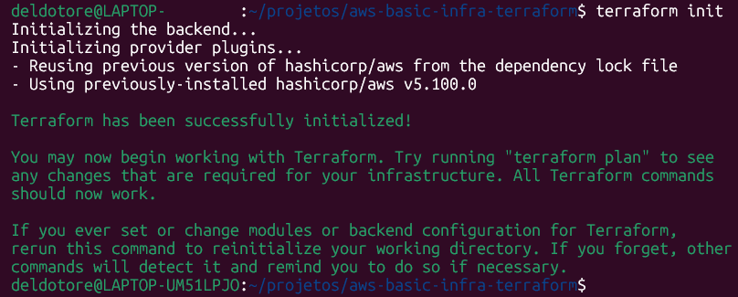
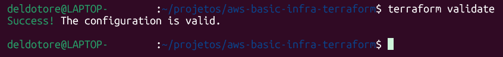
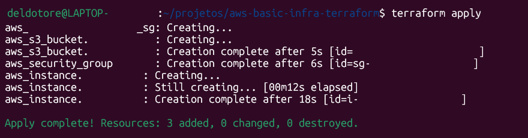
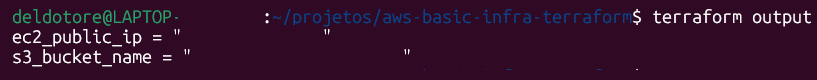
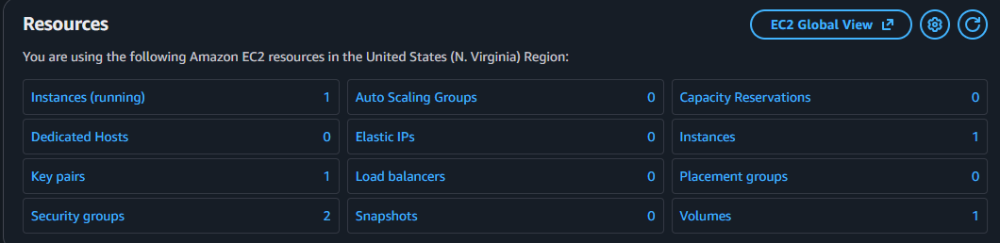
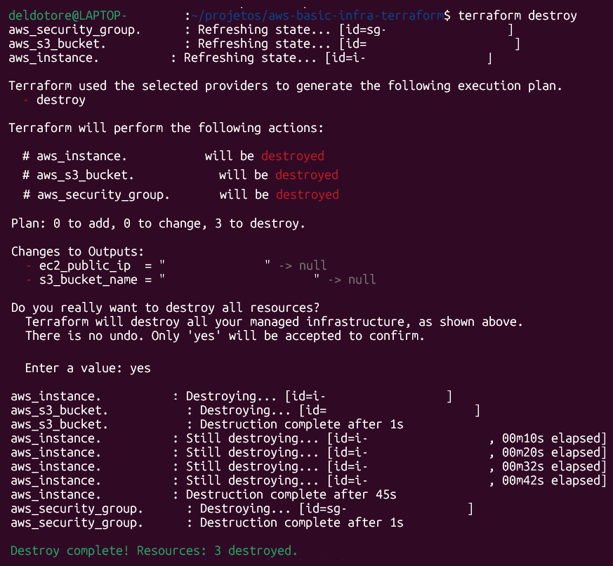
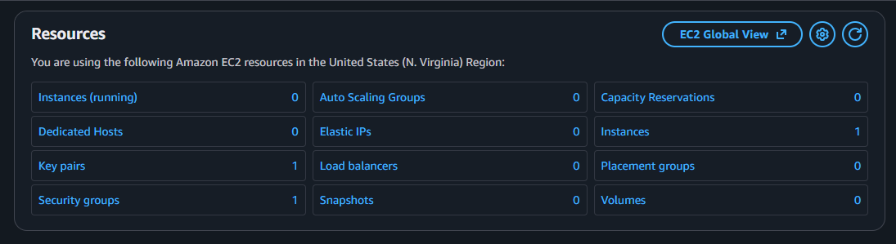

# AWS Basic Infra Terraform

> **Aviso:** Este projeto cria um **ambiente efêmero na AWS**, ideal para aprendizado e testes.
>
> * Configurado com uma **instância EC2 de baixo custo** (`t3.micro` por padrão), mas você pode alterar conforme necessidade.
> * As regras de segurança (Security Group) foram definidas com **IP genérico** por padrão.
>
>   * Atualize para o seu IP ou use `0.0.0.0/0` para acesso de qualquer lugar (não recomendado em produção).
> * Nenhuma informação sensível está incluída neste repositório. Todos os dados específicos devem ser substituídos pelo usuário antes de aplicar.

---

## Estrutura do Projeto

```
aws-basic-infra-terraform/
├─ diagrams/
│   └─ architecture.png
├─ main.tf
├─ variables.tf
├─ outputs.tf
├─ provider.tf
├─ terraform.tfvars
└─ README.md
```

* **main.tf**: Criação de S3 bucket, Security Group e EC2.
* **variables.tf**: Variáveis configuráveis.
* **outputs.tf**: Outputs da infraestrutura.
* **terraform.tfvars**: Valores genéricos para as variáveis.

---

## Pré-requisitos

* Terraform >= 1.8.0
* AWS CLI configurada com perfil válido
* Conta AWS com permissões para criar:

  * EC2
  * Security Group
  * S3 Bucket

---

## Configuração das Variáveis

Edite o arquivo `terraform.tfvars` para definir valores específicos da sua conta:

```hcl
aws_region    = "us-east-1"
aws_profile   = "default"
project       = "my-project"
environment   = "dev"
instance_type = "t3.micro"
owner         = "YOUR_NAME"
ssh_cidr      = "SEU_IP/32"       # Atualize para seu IP ou 0.0.0.0/0 (não recomendado)
http_cidr     = "SEU_IP/32"       # Atualize para seu IP ou 0.0.0.0/0 (não recomendado)
ami           = "ami-xxxxxxxxxxxx" # Substitua pela AMI desejada
```

**Observações:**

* `ssh_cidr` controla quem pode acessar a instância via SSH.
* `http_cidr` controla quem pode acessar via HTTP.
* Use `/32` para permitir acesso apenas de um IP específico.

---

## Passo a passo para rodar o projeto

### 1️⃣ Inicializar Terraform

```bash
terraform init
```



---

### 2️⃣ Validar a configuração

```bash
terraform validate
```



---

### 3️⃣ Ver o plano de execução

```bash
terraform plan
```


> Capture apenas o topo do plan e o resumo final:
>
> ```
> Plan: 3 to add, 0 to change, 0 to destroy.
> ```

---

### 4️⃣ Aplicar a infraestrutura

```bash
terraform apply
```

* Confirme digitando `yes` quando solicitado.



> Capture a mensagem final `Apply complete! Resources: X added, 0 changed, 0 destroyed.`

---

### 5️⃣ Verificar outputs

```bash
terraform output
```



> Substitua valores sensíveis (IPs, IDs de instâncias ou buckets) por placeholders se for compartilhar prints.

---

### 6️⃣ Confirmação no AWS Console



---

## Limpeza

Após os testes, remova os recursos da AWS:

```bash
terraform destroy
```

* Confirme digitando `yes` quando solicitado.



---

### Confirmação do destroy no AWS Console



* O dashboard, após o destroy, ainda mostra: 1 key pair (é o meu key pair, criado manualmente e mantido na AWS), 1 security group (é o SG padrão, estará sempre presente) e 1 instância (é a instância que foi derrubada - note que há 0 "instances running").

---

## Observações importantes

* AMI usada: Ubuntu 22.04 LTS (pode variar por região).
* Este projeto é **apenas para aprendizado/testes**. Ajuste recursos e regras conforme necessidade.
* Evite abrir portas para toda a internet (`0.0.0.0/0`) em ambientes reais.
* Sempre substitua os valores genéricos do `.tfvars` antes de rodar o Terraform.
* Para fins de portfólio, mantenha prints e outputs genéricos ou com placeholders.

---

## Sugestão de organização dos prints

```
prints/
├─ terraform-init.png
├─ terraform-validate.png
├─ terraform-plan.png
├─ terraform-apply.png
├─ terraform-outputs.png
└─ terraform-destroy.png
```

Isso mantém o README limpo e o projeto organizado para avaliação ou divulgação.
